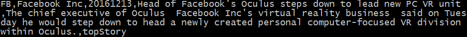

# Sentiment Analysis for Event-Driven Stock Prediction
Use NLP to predict stock price movement based on news from Reuters, we need the following 5 steps:

1. Data Collection

    1.1 get the whole ticker list

    1.2 crawl news from Reuters using BeautifulSoup
    
    1.3 crawl prices using urllib2 (Yahoo Finance API is outdated)

2. Applied GloVe to train a dense word vector from Reuters corpus in NLTK

    2.1 build the word-word co-occurrence matrix
  
    2.2 factorizing the weighted log of the co-occurrence matrix
  
3. Feature Engineering
  
    3.2 Unify word format: unify tense, singular & plural, remove punctuations & stop words
  
    3.2 Extract feature using feature hashing based on the trained word vector (step 2)
  
    3.3 Pad word senquence (essentially a matrix) to keep the same dimension
  
4. Trained a ConvNet to predict the stock price movement based on a reasonable parameter selection
5. The result shows a significant 1-2% improve on the test set


### 1. Data Collection


#### 1.1 Download the ticker list from [NASDAQ](http://www.nasdaq.com/screening/companies-by-industry.aspx)

```python
./crawler_allTickers.py 20  # keep the top e.g. 20% marketcap companies
```

#### 1.2 Use BeautifulSoup to crawl news headlines from [Reuters](http://www.reuters.com/finance/stocks/overview?symbol=FB.O)

*Note: you may need over one month to fetch the news you want.*

Suppose we find a news about Facebook on Dec.13, 2016 at reuters.com


We can use the following script to crawl it and format it to our local file

```python
./crawler_reuters.py # we can relate the news with company and date, this is more precise than Bloomberg News
```



By brute-force iterating company tickers and dates, we can get the dataset with about 30,000 ~ 200,000 news in the end. Since a company may have multiple news in a single day, the current version will only deal with topStory and ignore the others.

#### 1.3 Use urllib2 to crawl historical stock prices
 
Improvement here, use normalized return [4] over S&P 500 instead of return.

```python
./crawler_yahoo_finance.py # generate stock price raw data: stockPrices_raw.json, containing open, close, ..., adjClose
./create_label.py # use raw price data to generate stockReturns.json
```

### 2. Word Embedding

To use our customized word vector, apply GloVe to train word vector from Reuters corpus in NLTK

```python
./embeddingWord.py
```

Read the detail of the method [here](http://www-nlp.stanford.edu/pubs/glove.pdf), implementation [here](https://github.com/lazyprogrammer/machine_learning_examples/blob/master/nlp_class2/glove.py)

We can also directly use a pretrained GloVe word vector from [here](http://nlp.stanford.edu/projects/glove/)

### 3. Feature Engineering

Unify the word format, project word to a word vector, so every sentence results in a matrix.

Detail about unifying word format are: lower case, remove punctuation, get rid of stop words, unify tense and singular & plural using [en](https://www.nodebox.net/code/index.php/Linguistics#verb_conjugation)

Seperate test set away from training+validation test, otherwise we would get a too optimistic result.

```python
./genFeatureMatrix.py
```

### 4. Train a ConvoNet to predict the stock price movement. 

For the sake of simplicity, I just applied a ConvoNet in [Keras](http://machinelearningmastery.com/handwritten-digit-recognition-using-convolutional-neural-networks-python-keras/), the detail operations in text data is slighly differnt from the image, we can use the architecture from [FIgure 1 in Yoon Kim's paper](http://www.aclweb.org/anthology/D14-1181)

```python
./model_cnn.py
```

### 5. Prediction and analysis

As shown in the result, the prediction accuracy signifinantly improves around 1% - 2% compared to random pick.

### 6. Future work

From the [work](https://papers.ssrn.com/sol3/papers.cfm?abstract_id=1331573) by Tim Loughran and Bill McDonald, some words have strong indication of positive and negative effects in finance, we may need to dig into these words to find more information. A very simple but interest example can be found in [Financial Sentiment Analysis part1](http://francescopochetti.com/scrapying-around-web/), [part2](http://francescopochetti.com/financial-blogs-sentiment-analysis-part-crawling-web/)

As suggested by H Lee, we may consider to include features of earnings surprise due to its great value


## Issues
1. remove_punctuation() handles middle name (e.g., P.F -> pf)

## References:

1. Yoon Kim, [Convolutional Neural Networks for Sentence Classification](http://www.aclweb.org/anthology/D14-1181), EMNLP, 2014
2. J Pennington, R Socher, CD Manning, [GloVe: Global Vectors for Word Representation](http://www-nlp.stanford.edu/pubs/glove.pdf), EMNLP, 2014
3. Tim Loughran and Bill McDonald, 2011, “When is a Liability not a Liability?  Textual Analysis, Dictionaries, and 10-Ks,” Journal of Finance, 66:1, 35-65.
4. H Lee, etc, [On the Importance of Text Analysis for Stock Price Prediction](http://nlp.stanford.edu/pubs/lrec2014-stock.pdf), LREC, 2014
5. Xiao Ding, [Deep Learning for Event-Driven Stock Prediction](http://ijcai.org/Proceedings/15/Papers/329.pdf), IJCAI2015
6. [IMPLEMENTING A CNN FOR TEXT CLASSIFICATION IN TENSORFLOW](http://www.wildml.com/2015/12/implementing-a-cnn-for-text-classification-in-tensorflow/)
7. [Keras predict sentiment-movie-reviews using deep learning](http://machinelearningmastery.com/predict-sentiment-movie-reviews-using-deep-learning/)
8. [Keras sequence-classification-lstm-recurrent-neural-networks](http://machinelearningmastery.com/sequence-classification-lstm-recurrent-neural-networks-python-keras/)
9. [tf-idf + t-sne](https://github.com/lazyprogrammer/machine_learning_examples/blob/master/nlp_class2/tfidf_tsne.py)
10. [Implementation of CNN in sequence classification](https://github.com/dennybritz/cnn-text-classification-tf)
11. [Getting Started with Word2Vec and GloVe in Python](http://textminingonline.com/getting-started-with-word2vec-and-glove-in-python)
